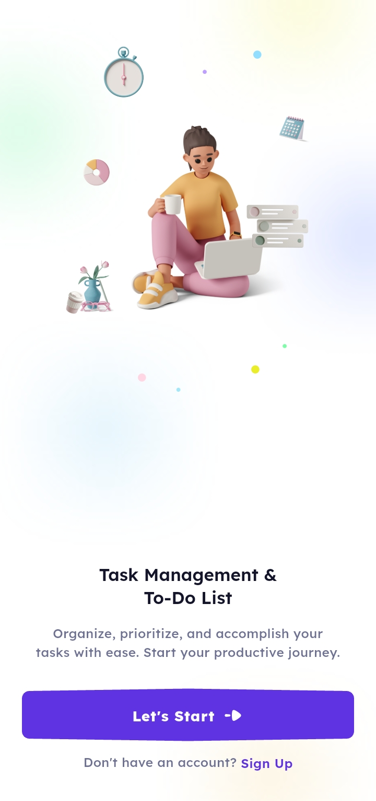
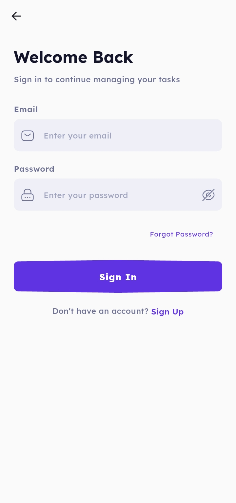
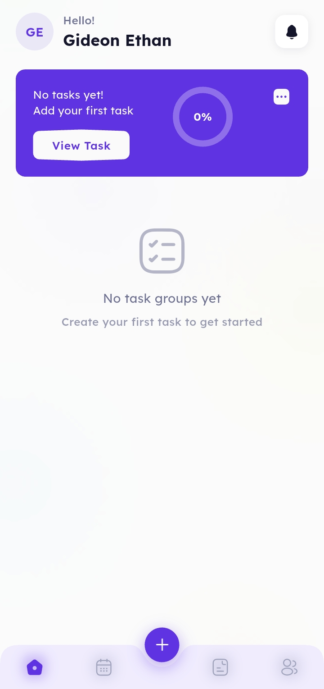
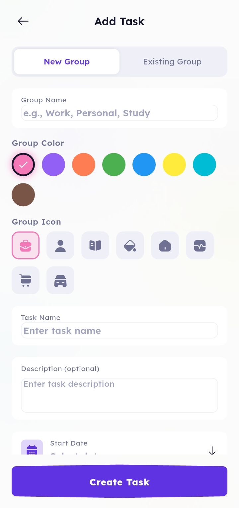
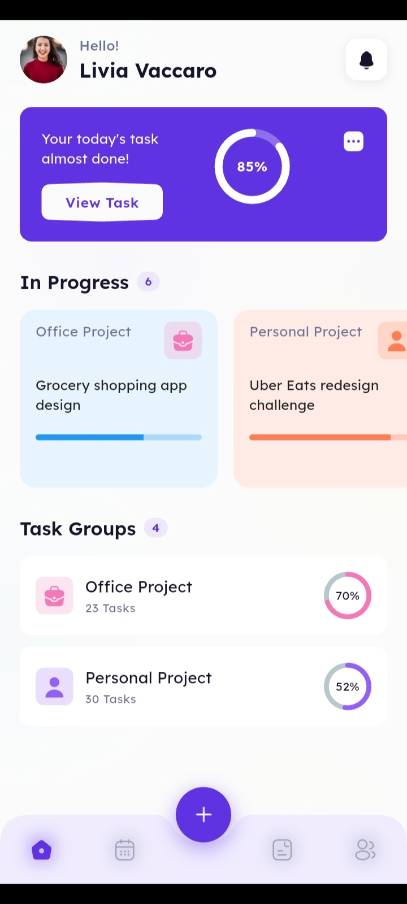

# 📋 Task Management & To-Do List App

A modern, beautifully designed task management application built with Flutter. This project was created as a **UI/UX learning exercise** to sharpen mobile design implementation skills, bringing a professional Figma design to life with clean, production-ready code.


---

## 🎨 Design Attribution

> **This app's UI design is based on the beautiful work by [Neser U](https://www.figma.com/@neseru) on Figma.**

**Original Design**: [Task Management & To-Do List App](https://www.figma.com/community/file/1143575071825582037)

The original design showcases a clean, modern task management interface with thoughtful UX patterns. This implementation faithfully recreates the design system while adding production-ready functionality including authentication, data persistence, and API integration.

**A huge thank you to SuspendedTeam for making this design available to the community!**

---

## 📖 Project Overview

### Purpose

This project serves as a **personal UI/UX skills development exercise**, focusing on:

- **Pixel-perfect implementation** of professional Figma designs in Flutter
- **Design system architecture** with reusable components, tokens, and themes
- **Production patterns** including state management, dependency injection, and clean architecture
- **Responsive layouts** that work beautifully across different screen sizes

### What I Learned

Building this app helped me develop expertise in:

- Translating Figma designs to Flutter widgets with consistent spacing, typography, and colors
- Creating a comprehensive design system with semantic color tokens and theme support
- Implementing smooth animations and micro-interactions
- Building reusable widget libraries that scale
- Integrating real backend APIs with offline-first local storage

---

## ✨ Features

### Core Functionality

| Feature | Description |
|---------|-------------|
| **Task Management** | Create, edit, delete, and organize tasks with rich details including title, description, dates, and custom icons |
| **Project Groups** | Organize tasks into color-coded project groups (Office, Personal, Daily Study, etc.) with visual progress tracking |
| **Calendar View** | Interactive horizontal date picker to view and filter tasks by date |
| **Task Status Workflow** | Track tasks through To-Do → In Progress → Done with swipe-to-update gestures |
| **Progress Tracking** | Visual progress indicators showing completion percentage for each project |

### User Experience

| Feature | Description |
|---------|-------------|
| **Beautiful Onboarding** | Full-screen hero illustrations with smooth navigation to login/register |
| **Authentication Flow** | Complete auth system with login, registration, and forgot password screens |
| **Profile Management** | User profile page with stats, settings, and account management |
| **Dark Mode** | Full support for light and dark themes that follow system preferences |
| **Pull-to-Refresh** | Refresh data with natural pull gestures throughout the app |

### Technical Features

| Feature | Description |
|---------|-------------|
| **Offline-First** | Local SQLite database with Drift ORM for offline data access |
| **API Integration** | RESTful API client with Dio for remote data synchronization |
| **State Management** | BLoC pattern for predictable, testable state management |
| **Dependency Injection** | GetIt service locator for clean dependency management |
| **Secure Storage** | Flutter Secure Storage for sensitive auth token storage |

---

## 📱 Screenshots

<p align="center">
  
  
  
</p>

<p align="center">
  
  
</p>

| Screen | Description |
|--------|-------------|
| **Welcome** | Beautiful onboarding screen with 3D illustration, gradient background, and smooth call-to-action buttons |
| **Login** | Clean authentication form with email/password fields, forgot password link, and sign up navigation |
| **Home (Empty)** | Dashboard showing empty state with greeting, progress card at 0%, and prompt to create first task |
| **Add Task** | Task creation with group selection (new/existing), color picker, icon picker, and date selectors |
| **Home (With Data)** | Full dashboard with progress percentage, in-progress task cards, and task group list with completion stats |

---

## 📋 App Screens Detail

| Screen | Description |
|--------|-------------|
| **Welcome** | Onboarding screen with hero illustration and call-to-action buttons |
| **Login** | Email/password authentication with form validation |
| **Register** | New user registration with name, email, and password fields |
| **Forgot Password** | Password recovery flow with email verification |
| **Home** | Dashboard with greeting, progress overview, project groups, and in-progress tasks |
| **Tasks** | Calendar-based task list with date filtering and status tabs |
| **Add Task** | Task creation form with project selection, dates, and icon picker |
| **Profile** | User profile with statistics, settings, and logout functionality |
| **Edit Profile** | Update user information including name and phone number |

---

## 🎨 Design System

This app implements a comprehensive **design system** extracted from the original Figma design, ensuring consistency and maintainability.

### Color Palette

| Color | Hex | Usage |
|-------|-----|-------|
| 🟣 **Primary** | `#5F33E1` | Main brand color, buttons, accents, interactive elements |
| 🟣 **Primary Light** | `#7B5AE8` | Hover states, secondary accents |
| 🟣 **Primary Surface** | `#EDE8FB` | Primary-tinted backgrounds, selected states |
| ⚫ **Black** | `#24252C` | Dark backgrounds, primary text in light mode |
| ⚪ **Off-White** | `#FAFAFA` | Light backgrounds, cards |
| 🔵 **Secondary** | `#6E6A7C` | Secondary text, icons, muted content |
| 🟡 **Accent** | `#F6E31A` | Highlights, badges, attention-grabbing elements |
| 🟠 **Warning/To-Do** | `#FF7D53` | To-Do status, warning states, Office category |
| 🟢 **Success/Done** | `#0ECC5A` | Done status, success states, Study category |
| 🔴 **Error** | `#F44336` | Error states, destructive actions |
| 🔵 **Info/In Progress** | `#2196F3` | In Progress status, informational states |

### Category Colors

| Category | Color | Surface Color |
|----------|-------|---------------|
| **Office/Work** | `#FF7D53` | `#FFE2D9` |
| **Personal** | `#5F33E1` | `#EDE8FB` |
| **Daily Study** | `#0ECC5A` | `#E0F9EA` |
| **Social** | `#E91E8C` | `#FDE2F1` |

### Typography

- **Font Family**: System default (Roboto on Android, SF Pro on iOS)
- **Headline Large**: 32px, Bold - Page titles, hero text
- **Headline Medium**: 24px, SemiBold - Section headers
- **Title Large**: 20px, SemiBold - Card titles, important labels
- **Title Medium**: 16px, Medium - Subheadings, list item titles
- **Body Large**: 16px, Regular - Primary body text
- **Body Medium**: 14px, Regular - Secondary body text
- **Label Large**: 14px, Medium - Button labels, form labels
- **Caption**: 12px, Regular - Timestamps, metadata

### Spacing Scale

| Token | Value | Usage |
|-------|-------|-------|
| `xs` | 4px | Tight spacing, icon gaps |
| `sm` | 8px | Default gap, list spacing |
| `md` | 16px | Section padding, card margins |
| `lg` | 24px | Major section spacing |
| `xl` | 32px | Page padding, large gaps |
| `xxl` | 48px | Hero spacing, major separations |

---

## 🏗️ Architecture

This project follows **Clean Architecture** principles with a **feature-first** folder structure, ensuring separation of concerns and maintainability.

```
lib/
├── main.dart                     # App entry point, initialization
├── core/                         # Shared infrastructure
│   ├── config/                   # App configuration
│   ├── database/                 # Drift database setup
│   │   ├── app_database.dart     # Database instance & connection
│   │   ├── tables/               # Table definitions
│   │   ├── repositories/         # Data access layer
│   │   └── data_seeder.dart      # Initial data seeding
│   ├── di/                       # Dependency injection (GetIt)
│   ├── logging/                  # App-wide logging
│   ├── network/                  # HTTP client & API services
│   │   ├── api_client.dart       # Dio HTTP client
│   │   ├── api_endpoints.dart    # API route constants
│   │   ├── dto/                  # Data transfer objects
│   │   └── services/             # API service implementations
│   └── theme/                    # Design system
│       ├── app_colors.dart       # Color palette & semantic colors
│       ├── app_typography.dart   # Text styles
│       ├── app_spacing.dart      # Spacing constants
│       ├── app_shadows.dart      # Shadow definitions
│       └── app_theme.dart        # ThemeData configuration
├── feature/                      # Feature modules
│   ├── auth/                     # Authentication feature
│   │   ├── bloc/                 # Auth BLoC (state management)
│   │   └── presentation/         # Auth screens (login, register, etc.)
│   ├── home/                     # Home/dashboard feature
│   │   ├── home_page.dart        # Main dashboard
│   │   └── nav_page.dart         # Bottom navigation shell
│   ├── tasks/                    # Task management feature
│   │   └── tasks_page.dart       # Calendar-based task list
│   ├── projects/                 # Project/group management
│   │   └── add_project_page.dart # Task creation form
│   ├── profile/                  # User profile feature
│   │   ├── profile_page.dart     # Profile & settings
│   │   └── edit_profile_page.dart # Profile editing
│   └── showcase/                 # Widget showcase (development)
└── shared/                       # Shared components
    ├── widgets/                  # Reusable UI components
    │   ├── app_bars/             # Custom app bars
    │   ├── avatars/              # Avatar components
    │   ├── badges/               # Status badges, icons
    │   ├── buttons/              # Button variants
    │   ├── calendar/             # Calendar strip widget
    │   ├── cards/                # Task cards, project cards
    │   ├── chips/                # Filter chips
    │   ├── inputs/               # Text fields, form inputs
    │   ├── lists/                # List items, settings rows
    │   ├── navigation/           # Navigation components
    │   └── progress/             # Progress indicators
    └── custom_app_background.dart # Gradient background widget
```

---

## 🗄️ Database Schema

The app uses **Drift** (formerly Moor) for type-safe SQLite database operations with an offline-first architecture.

### Tables

| Table | Purpose |
|-------|---------|
| **Users** | Local user profile storage for offline access |
| **Statuses** | Task status definitions (To-Do, In Progress, Done) |
| **TaskGroups** | Project categories with colors and icons |
| **Tasks** | Individual task records with full details |

### Sync Status

All tables include sync status tracking for future cloud synchronization:
- `synced` - Data matches server
- `pending` - Local changes waiting to sync
- `conflict` - Conflicts detected during sync

For detailed database documentation, see [LOCAL_DATABASE.md](docs/LOCAL_DATABASE.md).

---

## 🚀 Getting Started

### Prerequisites

- **Flutter SDK**: 3.9.2 or higher
- **Dart SDK**: 3.0.0 or higher
- **IDE**: Android Studio, VS Code, or IntelliJ IDEA
- **Emulator/Device**: iOS Simulator, Android Emulator, or physical device

### Installation

1. **Clone the repository**
   ```bash
   git clone https://github.com/yourusername/task_todo_app.git
   cd task_todo_app
   ```

2. **Install dependencies**
   ```bash
   flutter pub get
   ```

3. **Generate database code** (if needed)
   ```bash
   dart run build_runner build --delete-conflicting-outputs
   ```

4. **Run the app**
   ```bash
   flutter run
   ```

### Build for Production

```bash
# Android APK
flutter build apk --release

# Android App Bundle (for Play Store)
flutter build appbundle --release

# iOS (requires macOS)
flutter build ios --release

# Web
flutter build web --release
```

---

## 🛠️ Tech Stack

| Category | Technology | Purpose |
|----------|------------|---------|
| **Framework** | Flutter 3.9+ | Cross-platform UI framework |
| **Language** | Dart 3.0+ | Primary programming language |
| **State Management** | flutter_bloc, bloc | Predictable state management |
| **Database** | Drift, SQLite | Local data persistence |
| **HTTP Client** | Dio | API communication |
| **Dependency Injection** | GetIt | Service locator pattern |
| **Secure Storage** | flutter_secure_storage | Auth token storage |
| **Icons** | Iconsax Plus, Iconly | Modern icon sets |
| **UI Components** | percent_indicator, curved_navigation_bar | Additional UI widgets |
| **Utilities** | uuid, intl, path_provider | Helper libraries |

---

## 📦 Dependencies

```yaml
dependencies:
  flutter:
    sdk: flutter
  
  # UI
  cupertino_icons: ^1.0.8
  curved_navigation_bar: ^1.0.6
  iconsax_plus: ^1.0.0
  iconly: ^1.0.1
  percent_indicator: ^4.2.5
  
  # State Management
  bloc: ^9.2.0
  flutter_bloc: ^9.1.0
  equatable: ^2.0.7
  
  # Database
  drift: ^2.18.0
  sqlite3_flutter_libs: ^0.5.21
  path: ^1.9.0
  path_provider: ^2.1.5
  
  # Network
  dio: ^5.9.0
  
  # Utilities
  uuid: ^4.5.1
  get_it: ^8.0.3
  flutter_secure_storage: ^9.2.4
  logger: ^2.6.2
  intl: ^0.20.2

dev_dependencies:
  flutter_test:
    sdk: flutter
  flutter_lints: ^5.0.0
  drift_dev: ^2.18.0
  build_runner: ^2.4.13
```

---

## 🎯 Project Status & Roadmap

### Completed

- [x] Project structure and architecture setup
- [x] Design system implementation (colors, typography, spacing, shadows)
- [x] Light and dark theme support
- [x] Reusable widget library (buttons, cards, inputs, badges, etc.)
- [x] Welcome/onboarding screen
- [x] Authentication flow (login, register, forgot password)
- [x] Home dashboard with project overview
- [x] Calendar-based task list with filtering
- [x] Task creation form
- [x] Profile page with statistics
- [x] Local SQLite database with Drift
- [x] API integration with Dio
- [x] BLoC state management for auth
- [x] Bottom navigation with curved design

### In Progress

- [ ] Swipe-to-complete task gestures
- [ ] Task editing and deletion
- [ ] Project group management (create, edit, delete)

### Planned

- [ ] Push notifications for task reminders
- [ ] Data synchronization with backend
- [ ] Search functionality
- [ ] Task sorting and advanced filtering
- [ ] Statistics and analytics dashboard
- [ ] Widget tests and integration tests
- [ ] Accessibility improvements

---

## 🤝 Contributing

Contributions are welcome! This is a learning project, so suggestions for improvements are especially appreciated.

1. **Fork** the project
2. **Create** your feature branch (`git checkout -b feature/AmazingFeature`)
3. **Commit** your changes (`git commit -m 'Add some AmazingFeature'`)
4. **Push** to the branch (`git push origin feature/AmazingFeature`)
5. **Open** a Pull Request

### Code Style

- Follow the [Dart style guide](https://dart.dev/guides/language/effective-dart/style)
- Use the provided `analysis_options.yaml` for linting
- Write meaningful commit messages
- Add comments for complex logic

---

## 📄 License

This project is licensed under the **MIT License** - see the [LICENSE](LICENSE) file for details.

---

## 🙏 Acknowledgments

### Design Credit

A special thank you to **[SuspendedTeam](https://www.figma.com/@SuspendedTeam)** for creating and sharing the beautiful [Task Management & To-Do List App](https://www.figma.com/community/file/1143575071825582037) design on Figma Community. This project would not exist without their excellent design work.

### Technologies & Resources

- [Flutter](https://flutter.dev/) - Google's UI toolkit for building beautiful, natively compiled applications
- [BLoC Library](https://bloclibrary.dev/) - Predictable state management library for Dart
- [Drift](https://drift.simonbinder.eu/) - Reactive persistence library for Flutter and Dart
- [Figma](https://www.figma.com/) - Collaborative design tool
- [Iconsax](https://iconsax.io/) - Beautiful open-source icons

---

<p align="center">
  <strong>Made with ❤️ using Flutter</strong>
  <br>
  <em>A UI/UX learning project</em>
</p>

<p align="center">
  <a href="https://www.figma.com/community/file/1143575071825582037">View Original Design</a>
  •
  <a href="https://flutter.dev/">Flutter Documentation</a>
</p>
